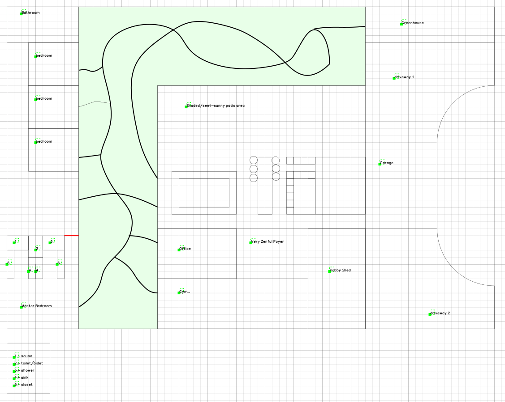
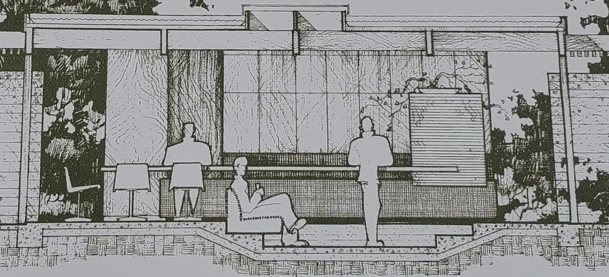
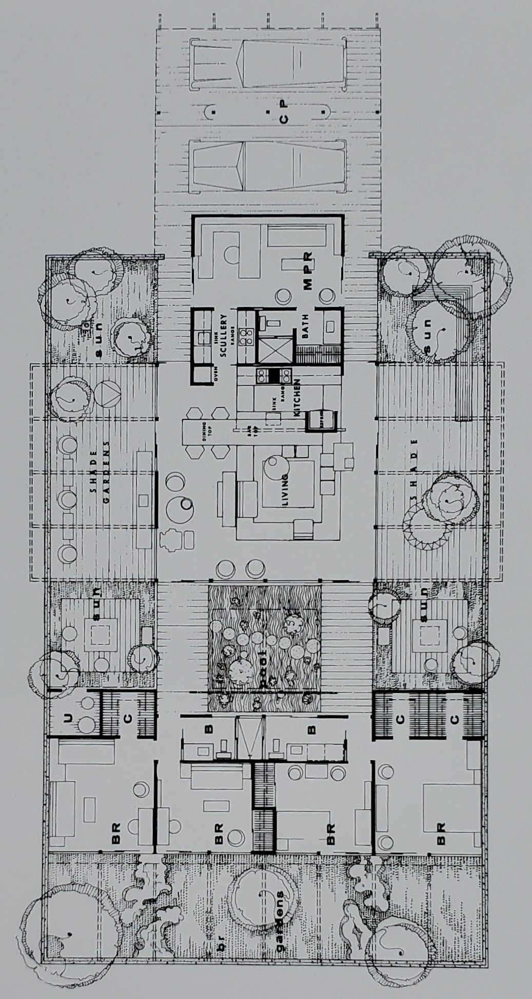
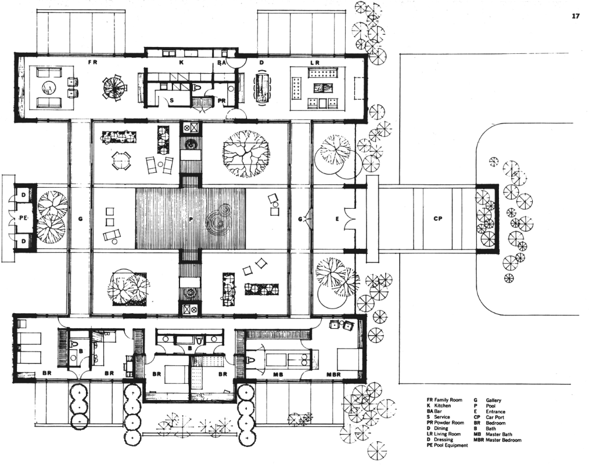

# The Devonshire House

The Devonshire House is a hybrid of [case study homes](https://en.wikipedia.org/wiki/Case_Study_Houses).  The overarching concept of the house borrows from case study home #4 - the Greenbelt House; the central focus of this home is the interior garden and greenery area with meandering walkways.  This space divided the home into two halves: the recreational space and the living quarters space.

## Recreational Space

The recreational space of the Greenbelt House had a kitchen, dining room, and a living room.  Instead of opting for the arrangement of as designed for the Greenbelt House, I used the design of case study home #24 to arrange the kitchen, the dining table jutting out from the kitchen island, living room area with recessed seating, and the shaded/sunny patio areas.

### Case Study House #24

## Living Quarters Space

The master bedroom and bathroom are inspired by case study house #28's master bedroom and bathroom (see #28's layout below).  The remainder of the space is a blend of the Greenbelt's house of simplicity and the consecutive flow of bedrooms that are in Case Study House #24.  In Case Study House #24, each room had its own access to the yard.  In the Devonshire House, the greenbelt interior maintains each bedroom's yard access.

## FAQ

**Why did you call it the Devonshire House?**

I used to live on Devonshire Street in the San Fernando Valley.  Case Study House 24 was designed to serve as a basis for a tract of [Eichler Homes](https://en.wikipedia.org/wiki/Joseph_Eichler) located near Mason Avenue and Devonshire Street in Northridge, California.  

During my sketching, I brewed some [Devonshire Earl Grey](https://www.uptontea.com/earl-grey-tea/earl-grey-loose-leaf-black-tea/p/V00727/) for the essence of this exercise.